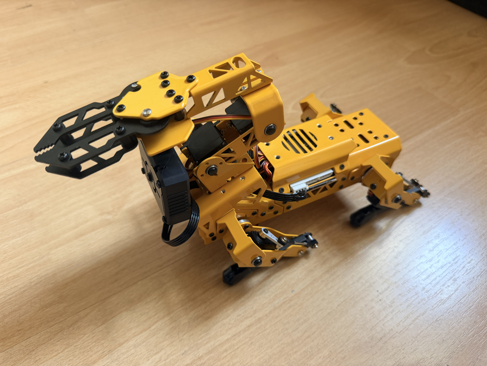
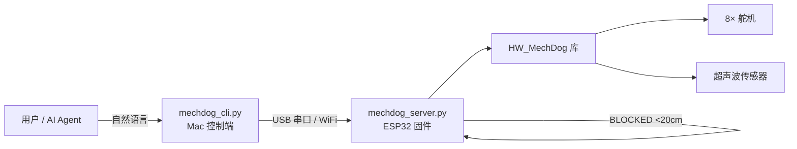
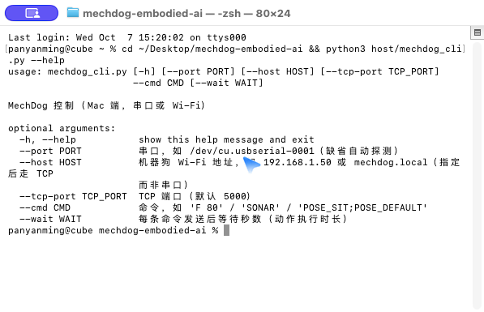

# MechDog Embodied AI（四足机器狗具身智能）

基于幻尔（Hiwonder）MechDog 四足机器狗 + AI Agent 的具身智能探索项目：通过大语言模型将自然语言指令直接转化为机器狗动作，探索"语言 → 动作"的端到端控制范式。

<div align="center">
  
</div>

## ✨ 特性

- **自然语言控制**：AI Agent 接收指令后直接驱动 8 舵机完成前进/后退/转向/坐下/趴下/姿态调整/动作组
- **双端架构**：Mac 控制端（Python CLI） + ESP32 指令接收固件（MicroPython），USB 串口或 WiFi 通信
- **超声波避障**：移动命令前自动测距，<20cm 自动停车
- **无线化改造**：ESP32 通过 WiFi 接收指令，脱离 USB 线缆束缚
- **VLA 探索**：验证视觉语言动作模型直控舵机的可行性（实验性）

## 🏗️ 架构



## 📦 核心板块详解

### ① 双端控制架构（CLI + 固件协议）

**搭建思路**：把"控制"拆成两个进程，中间只走一行文本协议——职责清晰、调试简单、可远程：

```
Mac 端 mechdog_cli.py ──(USB 串口 / WiFi TCP)──> ESP32 mechdog_server.py ──> HW_MechDog 库 ──> 8 舵机
```

- **主机端**：`mechdog_cli.py` 负责命令构造、串口/TCP 收发、结果回显；支持一次调用批量执行（`POSE_SIT;POSE_DEFAULT` 分号分隔）
- **设备端**：`mechdog_server.py`（MicroPython）常驻监听 stdin，逐行解析命令并调用官方库执行，每条命令返回 `OK ...` 便于确认

协议层刻意保持**纯文本、单行、大小写不敏感**，方便手动 `echo` 调试。

### ② 动作正确性工程（真实排障案例）

**搭建思路**：机器人动作"动了"不等于"动对了"。本项目用大量实测修正了官方库的两个隐蔽问题：

1. **`transform()` 旋转参数顺序是 `[roll, pitch, yaw]`**，官方 demo 注释写的是 pitch 在前——照注释写会前后倾变成左右倾（实测：请求前倾 8°，机器狗向左倾斜）。固件在内部做**顺序交换**，协议层 `TILT <pitch> <roll>` 语义保持直觉（+前/-后，+右/-左）
2. **库内 roll 正值 = 向左倾**（与直觉相反）——固件内部做 **roll 取反**，协议层无需感知

> 经验：驱动第三方硬件库时，不要信注释，用"单个轴小角度"逐项实测，把修正固化在适配层，而不是每次调用时手工调整。

### ③ 超声波避障与盲区处理

**搭建思路**：移动类命令执行前先测距，`<20cm` 自动停车（固件内置），避免撞墙/摔落。

实测记录（微信对话实录）：

- 用户指令"往前走快到墙停下" → 前进中超声波测到 **17.8cm 触发停车**，停在距墙约 18cm 处
- 小插曲：贴近墙后传感器连续读到 `6553.5`（超量程无效值——超声波近场盲区），后退 40mm 后恢复 `25.5cm`
- 结论：**传感器盲区不是故障**，固件需容忍无效值并自动恢复；向用户如实汇报细节，比"一切正常"更可信

### ④ 无线化改造（WiFi TCP）

**搭建思路**：有线串口调试方便，但落地场景要脱线。主机端 CLI 增加 `--host` 参数：

```bash
python3 host/mechdog_cli.py --host mechdog.local --cmd "F 80"
```

指定 `--host` 后走 TCP（默认端口 5000）而非串口；固件端对应增加 WiFi 监听。两条通道（USB/网线）并存，自动选择。

### ⑤ Agent 接入（Skill 化）

**搭建思路**：把机器狗控制封装成 Agent Skill，大模型获得"具身能力"——用户发自然语言，Agent 自动翻译成动作命令并汇报结果：

```markdown
# skills/mechdog/SKILL.md
## 执行准则
1. 收到指令后直接运行 CLI，不要重复确认
2. 连续动作用分号合并为一次调用
3. 执行完一句话汇报
```

技能文档完整版见 [`docs/mechdog-skill.md`](docs/mechdog-skill.md)。

## 🚀 快速开始

### 1. 烧录 ESP32 固件

将 [`esp32/mechdog_server.py`](esp32/mechdog_server.py) 上传到机器狗 ESP32（MicroPython），覆盖 `main.py`（**先备份原文件**）。用 Hiwonder Python Editor 或 mpremote 均可。

### 2. 安装 Mac 端依赖

```bash
pip3 install pyserial
```

### 3. 连接并测试

```bash
# 自动探测串口并 ping
python3 host/mechdog_cli.py --cmd "ping"        # → pong

# 前进 80mm
python3 host/mechdog_cli.py --cmd "F 80"

# 坐下 → 站立 → 握手（一次调用）
python3 host/mechdog_cli.py --cmd "POSE_SIT;POSE_DEFAULT;ACTION 7" --wait 2

# 超声波测距
python3 host/mechdog_cli.py --cmd "SONAR"
```

## 📸 运行演示

控制 CLI 真实运行界面（支持串口 + Wi-Fi 双通道）：



## 📜 命令协议

| 命令 | 含义 | 示例 |
|---|---|---|
| `ping` | 连通测试 | `ping` |
| `F <mm>` / `B <mm>` | 前进/后退（1~120） | `F 80` |
| `L <deg>` / `R <deg>` | 左转/右转（1~90） | `L 20` |
| `STOP` | 停止 | `STOP` |
| `POSE_DEFAULT` / `POSE_SIT` / `POSE_LIE` | 站立/坐下/趴下 | `POSE_SIT` |
| `HEIGHT <mm>` | 机身升降（-30~30） | `HEIGHT 20` |
| `TILT <pitch> <roll>` | 俯仰/横滚（-30~30） | `TILT 15 0` |
| `ACTION <n>` | 预置动作组（1~15） | `ACTION 7` |
| `SPEED <0-100>` | 步态速度 | `SPEED 60` |
| `SONAR` | 超声波测距 | `SONAR` |

## 🧩 接入 AI Agent

在 OpenClaw / 任意 Agent 框架中注册该 CLI 为工具（Skill）：

```markdown
# skills/mechdog/SKILL.md
## 执行准则
1. 收到指令后直接运行 CLI，不要重复确认
2. 连续动作用分号合并为一次调用
3. 执行完一句话汇报
```

Agent 即获得"让机器狗前进/坐下/握手"等具身能力。完整技能文档见 [`docs/mechdog-skill.md`](docs/mechdog-skill.md)。

## 📁 项目结构

```
mechdog-embodied-ai/
├── host/
│   └── mechdog_cli.py      # Mac 端控制 CLI（pyserial）
├── esp32/
│   └── mechdog_server.py   # ESP32 MicroPython 固件（需烧录）
├── docs/
│   └── mechdog-skill.md    # Agent 技能接入文档
└── assets/
    └── mechdog-photo.jpg   # 实拍照片
```

## ⚠️ 已知坑（实测记录）

1. **`transform` 旋转参数顺序是 `[roll, pitch, yaw]`**，且库内 roll 正值=向左倾（与直觉相反）——固件已在内部做顺序交换 + roll 取反，协议层语义正确，**不要二次调整**
2. **动作名必须用官方拼写**：坐下的动作名是 `sit_dowm`（官方拼写错误，库只认这个），趴下 `go_prone`，传 `sit`/`lie` 会被库静默忽略
3. ESP32 固件的 `stdin` 非阻塞，需用 `select.poll()` 轮询（已内置）
4. 基础版无发光超声波模块时 `SONAR` 返回 `N/A`（正常）
5. 串口响应偶尔夹带 `$$>1<$$` 杂讯（mpremote 残留），以 `OK` / `pong` 为准

## 🔒 安全规则

- 动作前先 `POSE_DEFAULT` 复位，避免翻倒
- 步幅 ≤120mm、转角 ≤90°
- 桌面/高处禁止移动命令，防止摔落
- 长时间动作后让舵机休息（过热保护）

## 📄 License

MIT
